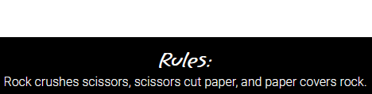
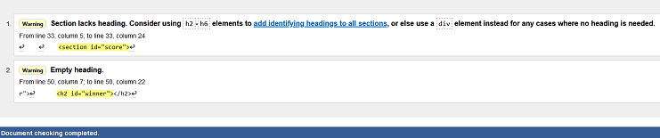
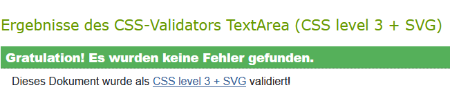
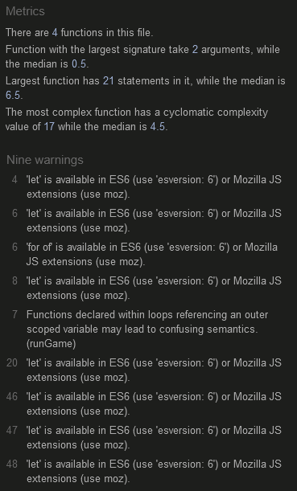
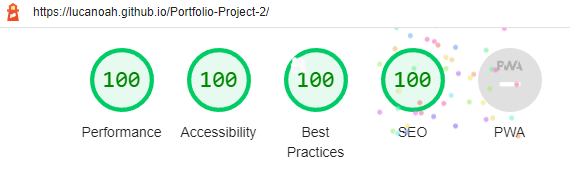

# ROCK, PAPER, SCISSORS!

ROCK, PAPER, SCISSORS! is a website that wants to show the user the use of JavaScript in a realistic application by means of a small but legendary game. 

Likewise, everyone is invited to play this legendary game for fun.

## Features
---
### Heading
- Is located at the top of the page.
- In capital letters and rustic font it presents the title of the website.
- The title ROCK, PAPER, SCISSORS! makes it clear that the well-known game Rock, Paper, Scissors can be played by users here.

### Choose Section
- Here begins the main area of the page.
- Invites the user to select between rock, paper, & scissors via 3 buttons.

### Score Section
- Shows the current score of the user and that of the computer.
- The background of the number, is colored in the corresponding color.

### Game Section
- Here are 2 colored circles one as a playing field for the user and one as a playing field for the computer.
- Before the player has made a selection, both fields are empty except for the label.
- Once the player has made his selection, his selection appears in his field and a randomly generated selection appears in the computer's field.

### Winner Section
- Indicates in words the winner of the game just played.
- Before the player has made a selection, nothing is displayed here.
- As soon as the player has made his selection, the winner or a draw is immediately displayed here.

### Footer/Rules Section
- Here ends the main area of the page.
- At this sticky footer the user can see the rules of the game.
- Below 850px display height, the section title is no longer displayed as it is not strictly necessary. This is for the benefit of responsiveness.

## Testing
---
- I tested that this page work in different browsers: Chrome, Firefox & Microsoft Edge.
- I confirmed that this project is responsive, looks good and functions on all standard screen sizes using the DevTools device toolbar.
- I confirmed that the websites text is all readeable and easy to understand.

### Validator Testing
- HTML

The warnings can be ignored.

- CSS

- JavaScript

The warnings can be ignored.

- Accessibility

I confirmed that the colors and fonts chosen are easy to read and accessible by running lighthouse in DevTools.

## Deployment
---
The site was deployed to GitHub pages. The steps to deploy are:
- In the GitHub repository, navigate to the Settings tab.
- From the source section drop-down menu, select the Master Branch.
- Once the Master Branch has been selected, the page provided the link to the completed website.

The live link ca be found here - [ROCK, PAPER, SCISSORS!](https://lucanoah.github.io/rock-paper-scissors/)

## Credits
---
I got the buttons hover shadow effect (line 51 in style.css file) from here - [W3schools](https://www.w3schools.com/css/css3_buttons.asp)

